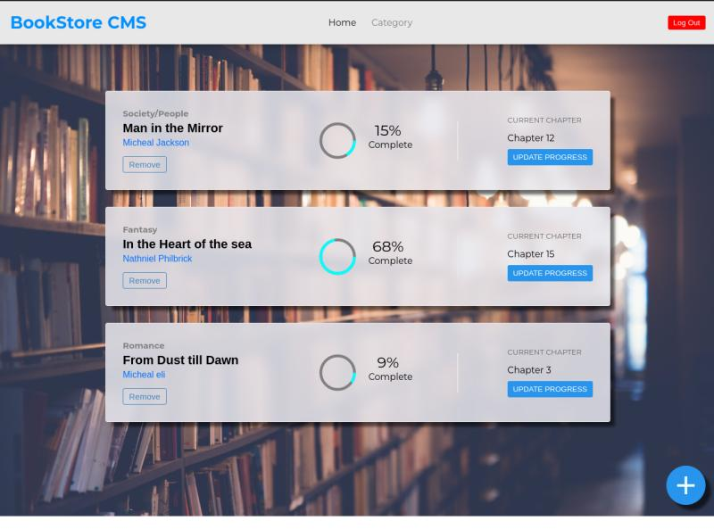

# Bookstore

The BookStoreCms is a website that enables a user to store their books in order and to keep track of them. A user can add, update and delete a book on the go, wherever they are so long as they have an internet connection.

- Display a list of books.
- Add a book.
- Remove a selected book.

Check the live demo [here](https://bookstorecms.vercel.app/)

## Built with
- React
- CSS3
- redux-toolkit

## Getting Started
To get a local copy up and running follow the steps below

### 
- clone this repo by copy pasting this on your terminal ``https://github.com/daudi13/bookstore-firebase``

- open the project folder 'cd bookstore'
- Run 'npm install' to install all dependencies
- Run 'npm start' to start the live server

## Author
**David Ouma**
- Github: [@daudi13](https://github.com/daudi13/)
- Twitter: [@davouma](https://github.com/daudi13/)

## Contributing
Contributions, issues, and feature requests are welcome!

Feel free to check the [issues page](https://github.com/daudi13/bookstore-firebase/issues)

## Show your Support
Give a star if you like this project!

## License
This project is under the [MIT](./LICENSE) license.
